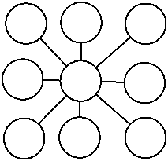
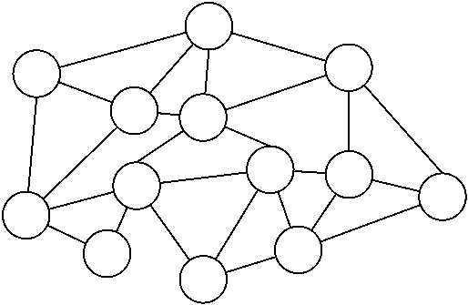

In September 2016, the CEO of Cambridge Analytica, Alexander Nix, gave a presentation at the annual Concordia Summit in New York City.  His presentation, 'The Power of Big Data and Psychographics', described how his company had assisted the unsuccessful bid of US Sensor Ted Cruz for the Republican Party nomination for the 2016 US Presidential election.  Nix explained that his company had developed a model to "predict the personality of every single adult in the United States of America" based on "hundreds and hundreds of thousands" of responses by Americans to a survey.  The purpose of this model was to tailor political messages to target individuals with particular personality traits.  As Nix explained: "Today communication is becoming ever increasingly targeted. It's being individualised for every single person in this room. [...] [Y]ou'll only receive adverts that not only are on the products and services, or in the case of elections, issues that you care about most, but that have been nuanced in order to reflect the way you see the world." [@noauthor_power_2016]

While Cambridge Analytica would later close after intense scrunity about how they acquired data via a personality test app they deployed on Facebook [@solon_cambridge_2018], the techniques Nix described demonstrate the possibilities for political messaging that the combination of social media and big data analytics offers.  Indeed, the reelection campaign for President Barack Obama in the 2012 US Presidential election was innovative for its use of social media and big data analytics [@oneil_weapons_2016, pp. 188-193].  Political organisations now have the tools to identify issues important to specific individuals, determine how to present their case in the most effective way for those individuals, and the means to communicate their message directly to them without others seeing the same message.  Political discourse is becoming a private conversation between the speaker and the targeted audience.

Making political discourse private risks undermining the public discussion of political views and identities.  A stable democracy requires a shared identity and political culture, a common *demos*, to prevent it fracturing into separate political communities.  This in turn necessitates some common communication network for political messages to be transmitted, understood, and evaluated by citizens.  Hence, what demarcates one *demos* from another are the means of communication connecting the citizens of those *demoi*, allowing them to debate and persuade each other on the proper conduct of government and on issues of common interest. 

For the ancient Athenians, their public sphere was the *agora* (marketplace); for the Federalists in the American colonies, the newspaper; for us today, it is the Internet.  Until now, the physical nature of these communication networks has resulted in a trade off between the reach of political messages (the numeric and geographic composition of the *demos* who receives political messages and may participate in the public sphere) and the ability to target the content of a message on that network toward individual citizens. 

One-to-one interpersonal conversation in the *agora* was highly targeted but could reach only as far as a voice could be heard.  The speakers and audience were well known to each other through personal interaction.  As the printing press and later television allowed for greater and greater reach, the content of these messages became more generic as the speakers became more distant from their audience.  The wider the audience grew, the less a message could be targeted at a particular audience segment without alienating others.  The risk to reputation and credibility that making false claims and conflicting promises to different groups increased as more people could receive messages and identify contradictions and errors to the rest of the audience.

The Internet and big data analytics have changed the nature of political communication by decoupling message reach from message targeting.  It allows individually tailored content to be distributed on a global scale without fear that the content of those messages will be overheard by others who may contest or reject it. Politicians are freed from the constraints imposed on what they say by the public presentation and discussion of arguments and claims.  It frees political actors to engage in sophistry and demagoguery.

In this chapter, we explore what impact this decoupling has on democracy.  We describe how political discussion in democracies has changed over time, as both communication technology and the number of people included in the *demos* have changed.  We show that communication technology has previously increased the reach of political messages while also making such messages more public and less targeted towards particular individuals or groups.  We then show how social media and big data combine to create echo chambers of political discourse that undermine the role that epistemic and cognitive diversity play in underpinning epistemic justifications of democracy.

# Part I - Democracy and Demagoguery

Plato is infamous for his disdain of democracy.  Like being ruled by a jury of children, democracy erodes reason by suffocating the voice of wisdom in a cloud of ignorance.  Like a ship at sea, the state needs specialist knowledge and skill - the keen eye of the navigator and the calm hand of an experienced captain - to steer it through troubled waters.

Decisions made by an unskilled and uniformed _demos_ will always be inferior to those of philosopher-monarchs.  Democratic policy will be determined by base desire rather than reason.  A state ruled by the people will inevitably succumb to the siren's song of a persuasive orator whose lust for power and manipulation of the masses can only result in tyranny.  To rule well, one must have expertise, knowledge, and wisdom. It is obvious then that the decisions of an _epistocracy_ will be superior to the decisions of a _democracy_.

2000 years later, the polymath Sir Francis Galton harboured similar thoughts about decision making.  He was surprised to discover, however, that after calculating the results of 787 bets on the estimated weight of an ox at a country fair, the median result of the _vox populi_ was within 0.8% of the actual weight [@galton1907].

This unexpected result highlights the intriguing epistemic value of collective decision making involving disparate actors - that whenever people of diverse cognitive ability reason collectively in a setting that rewards truth tracking, the collective judgment will be, probabilistically at least, superior to the judgment of any one individual.

The superior epistemic value of collective reasoning is a theme found across a variety of disciplines.  In economics, [@hayek_use_1945] championed the superiority of free-markets over centrally planned economies where free individual actors informed by price signals can better allocate resources than a central committee, despite no one actor having a comprehensive overall understanding of the economy.  In science, [@kitcher1990] demonstrated how individual cognitive diversity improves collective knowledge when we don't know the truth ahead of time.  Sometimes dubbed the _wisdom of the crowds_ [@surowiecki2004], these approaches to collective decision making have recently manifested as prediction markets for intelligence analysis (@cia) and data science out-sourcing [@kaggle].

Democracy, of course, is no stranger to this epistemic theme.  Whilst Plato may have preferred an epistocracy, scholars since the enlightenment have been illustrating democracy's epistemic power.  Rousseau thought that individuals stating their opinion on a matter by voting would elicit the general will of the people, a general opinion that would be superior than one's own [@rousseau_social_2012].  [@mill_liberty_1977 (chapter II)] argued that free expression in public debate allows us to exchange our errors for truth while [@dewey1935 (_Liberalism and Social Action_ §52)] saw democracy as a way to share the rich store of accumulated wealth of human knowledge.

These _epistemic_ justifications of democracy have seen a resurgence in contemporary political theory in a range of accounts such as public reason [@rawls_political_2005], deliberative democracy [@habermas1989, @goodin2017], and procedural accounts [@list2001, @estlund2009].  Despite their diversity in _how_ they justify democratic legitimacy, epistemic accounts are united in their claim that democratic processes are better, on average at least, at tracking the truth on particular matters than any one individual is. 

Plato's scepticism of democracy's epistemic value is justified, however, when one considers the cognitive capacities and skills of its individual constituents.  For over 50 years, political and social scientists have been documenting how poorly informed the voting of democratic citizens is [@converse1964].  News polls regularly show how widespread the public's lack of basic political knowledge and belief in untruths are.  Two thirds of American voters, for example, cannot correctly identify the three branches of government, and 70% thought Saddam Hussein was personally responsible for the 9/11 attacks [@shenkman2009, p. 4].

The problem of voter ignorance remains a rich field of study in political theory that has not diminished with time.  This consistency is understandable when one considers the breadth and depth of complexity required to effectively govern a modern state, combined with the diminishingly marginal influence of a vote in large electoral democracies.  That voters choose remain ignorant on political matters that they have no hope of mastering turns out to be a rational decision [@downs1957].

Yet even if citizens had the means and motivation to become adequately informed on all matters political, it is doubtful that they would even be capable of reasoning about policy rationally.  Cognitive psychologists have documented an enormous range of biases and flaws in everyday human reasoning: the difference between how we _should_ reason as rational beings, and how we _actually_ reason.  We accept things as true based not on their merits but on how easy they are believe, or how good they make us feel [@frederick2005].  We form conclusions before we examine our premises [@tversky1973].  We make different decisions with the same information depending on the order it is presented [@hogarth1992].  We value avoiding losses far more than gaining the same amount [@tversky1992].  We seek out evidence like to confirm our prior beliefs and avoid evidence likely to refute it [@nickerson1998] and we believe things are true long after being shown they are false [@anderson1980].

These biases especially manifest themselves when reasoning about politics.  Voters reason like sports fans, largely incapable of objectively assessing the merits of policy [@somin2006].  [@taber2006], for example, demonstrates how prior voter attitudes to particular policies strongly influence how arguments for those policies are evaluated, uncritically accepting arguments congruent with their prior beliefs and unreflectively rebutting those that aren't.

And education and intelligence don't make us immune from reasoning irrationally about politics.  When presented with empiric claims about cause and effect, increasing numeracy increases one's ability to reason correctly about scientific claims but decreases one's ability to reason correctly about the same claims when presented as policy choice [@kahan2017].  Our need to maintain congruence with our political identities trumps our desire to reason coherently about politics.

Yet democratic decision processes, whether merely aggregative like voting, or transformative like deliberation, somehow manage to overcome these foibles of individual cognition and values, to produce a collective epistemic virtue that is superior to that of any one individual.

In a purely aggregative account of democracy such as Condorcet's Jury Theorem, voters need not interact beyond voting for majorities to deliver these superior epistemic outcomes.  Condorcet's Jury Theorem is a mathematical proof that shows so long as voters on average have a better than even chance of being correct on some issue, the likelihood of the majority vote being correct approaches certainty as the number of voters increases [@condorcet1976][^cjt].  To give the theorem some concrete context, if the average competence of the electorate is just 51% (marginally better than a coin flip), then the majority vote of 101 voters has a 57% chance of being correct, and that of 10,001 voters has a 99.99% chance.

[^cjt] The Jury Theorem makes a number of assumptions about voter competence, voter independence, and the objective correctness of some binary choice.  Since Condorcet first published his theorem in 1785, many of these assumptions have been generalised, strengthening the robustness of its claim to justify democracy on epistemic grounds [see @baker1976, @berend1998, @owen1989, @kanazawa1998, @fey2003, @list2001].

Underpinning the superiority of collective over individual decision making in aggregative accounts like the Jury Theorem is the nature of randomness in our imperfect reasoning abilities.  As we have seen, human cognition has many biases that lead to faulty and inconsistent reasoning.  However small, we all have some propensity for divining the correct answer to a question concerning our collective lives but this propensity is limited by a degree of random error (often large) in our reasoning processes.  Yet if these random errors are normally distributed, then across large numbers of individuals, the errors will cancel each other out and an accurate approximation to the truth will be uncovered.  There is wisdom in the crowd.

Transformative accounts like deliberative democracy take these epistemic claims further by identifying both which choices are superior and why [^deliberation] assists decision making. Comprehensive and informed public discussion of political issues surfaces multiple points of view.  Robust and substantive debate ensures that matters are decided on their merits in terms accessible by all parties.  The public nature of the deliberation helps identify flaws in one's own reasoning and position, thus limiting the negative affects of individual biases such as the framing effect [@druckman2004, p. 675].  And while the requirements and epistemic claims of deliberative accounts may seem overly demanding or utopian to realist perspectives, the epistemic power of deliberative decision making has been demonstrated empirically in both experimental and field settings [@fishkin1997, @luskin1999, @neblo2007]. 

[^deliberation]: There is a rich and diverse literature on Deliberative Democracy that we barely skim here.  For specifics of deliberative accounts, see [@bessette1980deliberative, @cohen1989deliberation, @gutmann2009deliberative, and @fishkin2008debating].

Yet all this justification of democracy on epistemic grounds presupposes that the participants in this public discourse are seeking the truth, that they are voting and deliberating authentically, and not seeking to manipulate the outcome of the process for their own benefit.  As history has shown on occation, however, self-interest can lead to the subversion of democracy's truth tracking capabilities for private ends.  While democratic processes can transform the challenges of individual cognitive biases and diverse belief systems into epistemic virtue when citizens seek the truth, this epistemic virtue is at risk when individuals seek to corrupt it. 

Political manipulators corrupt democracy by employing demagoguery and sophistry.  They do so by exploiting the psychological disconnect between what people _do_ believe and what people _should_ believe.  Demagoguery and sophistry are two reasons for Plato's hostility to democracy.  In the *Sophist* (267b-c), Plato distinguishes between demagogues (someone who "can maintain his insincerity in long speeches to a crowd") and sophists (those using "short speeches in private conversation to force the person talking with him to contradict himself").  Demagogues seek and maintain political power by exploiting prejudice and ignorance within the citizenry, and by portraying themselves as the only solution to the society's real or imagined problems.

Sophistry on the other hand, use of argumentative and persuasive techniques to convince an audience of something even if it is inconsistent with the facts or the audience's own stated beliefs and commitments.  In the *Gorgias*, Plato's Socrates presses the claim against the orator Gorgias that a good orator can be more persuasive to those without expert knowledge of a subject than an expert (459b). As a result, skilled communicators can be persuasive without necessarily being knowledgeable about their subject.  If the audience is poorly educated about the subject under debate, they may be persuaded to accept a conclusion that does not depend on the truth of its statements or the logic of the arguments presented to convince its audience to support a political decision [^sophistry].

[^sophistry]: Unlike Plato, we make no important distinction between sophistry and demagoguery as one can use clever but fallacious arguments to exploit an audience's ignorance and prejudices.  As such, we will use the terms interchangeably.

It is important to note here that political manipulators don't need to change the voting patterns of large swaths of the citizenry in order to subvert the epistemic value of democracy.  Small shifts at the margins are often sufficient.  Trump's win in the 2016 US Presidential election, for example, was decided by fewer than 100,000 votes across three key states of Michigan, Pennsylvania, and Wisconsin [@fec2016].

Neither do they need to radically shift the beliefs of the citizenry from one side of an issue to the other.  Empiric research suggests that it is very difficult to change voting behaviour of citizens who already identify strongly with a particular party or issue [@hillygus2014].  Despite our cognitive flaws, and sometimes because of them, it is difficult to alter entrenched beliefs [@kosloff2010].  Instead, political manipulators can undermine the epistemic virtue of democracy in four key ways: by increasing voter turnout amongst protagonistic voters; by suppressing voter turnout amongst antagonistic voters; by shifting voter preference amongst undecided voters; and by undermining confidence in the legitimacy of democratic outcomes.  Thankfully, a feature of our political networks limits the scope to engage in sophistry and provides democracy with an additional degree of epistemic robustness.

# Part II - The Network & The Demos

The idea of democracy presupposes the notion of a _demos_ - some determinate group of individuals who form a _people_.  It is this people, and not some other, for whom democracy is the rule of, by, and for.  It is this people, and not some other, who share political rights and owe duties to each other.  

A stable democracy requires a shared identity and culture.  Its people need to identify as one group if they are to hold sufficient solidarity necessary for collective rule.  Without this shared identity then, the _demos_ is likely to fracture into smaller _demoi_.  This shared identity need not be exclusive though. An individual may identify with multiple overlapping _peoples_ but the individuals within a _people_ must always identify as one.

A shared identity however, requires some means to share it.  A _demos_ requires some form of communication network for its culture, norms, and political messages to be transmitted, understood, and evaluated by its citizens.  The classical model of communication has four components: the communication source, the message communicated, the medium or channel used, and the receiver of the communication [@lilleker_key_2006, p. 17].  

We define a _political network_ then, as the communication network between individuals who share some common political identity.  The senders and receivers of political information - both explicit political messages as well as common norms and cultural information - are its citizens.  The set of nodes and connections between them constitutes a given _demos_.  The pattern of these connections is the network's _topology_ and the topology of the political network represents the political structure of the _demos_.  In this light, democratic institutions can be conceptualised as mediated communication networks connecting private individuals (the citizens) with their collective identities (their citizenship).  What demarcates one _demos_ from another, then, is a function of the communication networks that connect the citizens of those _demoi_.  

Political and military historians have long acknowledge the central role of communication in command and control [@kolb2015, @bousquet2009].  To rule, one must have appropriate means to communicate one's intent, but different network topologies enable different types of political rule.  One such topology is the star pattern shown in figure 1.  The connected central node holds a privileged communicative position enabling it to rule or exercise some form of direction over the other nodes.

 

Contrast this with a more decentralised topology in figure 2.  Here, the nodes enjoy a greater degree of communicative equality and _share_ connections with each other rather than having their connections mediated through some central node.  These topologies tend to resemble a web or cluster of connected nodes and while some nodes may have more connections than others, all nodes have a relatively unmediated path to every other node.

 

Whilst both types of topologies will be present in all types of political networks to some degree, it is our contention that democratic societies require decentralised or peer-to-peer _democratic_ topologies within their _public spheres_ in order to realise the democratic demands of popular sovereignty and political equality.  If citizens are to form a shared identify and engage in informed political discourse with each other, then they require a shared _public_ forum to do so in.  Autocratic societies, by contrast, require only centralised _autocratic_ topologies.  They require only a means for the ruler to communicate with citizens and not for citizens to communicate with each other.

Yet these political topologies are themselves a function of the communicative medium.  In the early democracies such as Athens, communication was limited to face-to-face discussion or parchment.  The means of political communication were limited the range of one's voice or how far a letter could be carried.  The scope of shared political identity was therefore limited to one's neighbours and neighbour's neighbours.  Democratic government was limited to city-states as the necessary means of shared public discourse for larger scale rule was missing.[^size]

[^size]: This is not to say that larger empires were not possible given the communication technologies of voice and parchment.  The Roman Empire for example, shows how very large scale rule was possible with this technology.  The communication networks Rome used to exercise command and control over vast swathes of Europe and Africa however, relied on autocratic rather than democratic topologies.  It could connect the Senate to its governors but not the Egyptians with the Gauls.  The nascent democratisation of Gracchi's Rome never extended to the rest of the territories under Roman control because the information flows necessary to facilitate a shared political identity require a sufficiently dense concentration of connections between citizens that was impossible.  A _demos_ cannot grow beyond its political network.    

As communication technology developed, so to did the scope of political rule and association.  The invention of the printing press and rise of pamphlets and newspapers as modes of political communication increased the possible scope of democratic association.  Democracies in this technological era emerged in the American colonies and suffrage expanded in England.  Later, the development of radio and television saw the reach of political rule and scope for association expand further.

Just as these new communication technologies increased the geographic range of the political network, they also increased the communicative privilege of those who controlled them.  Unlike face-to-face discussion, these new technologies were mediated by a publisher or broadcaster.  No longer was political identity and emergent construct of a decentralised network, print and broadcast media allowed political identity to be constructed [@somers1994].  Yet unlike communication by letter or parchment, these new mediums were _public_ -- available to all (with the appropriate receiver).  And it was the public character of these technologies that helped provide democracy with a degree of epistemic robustness against sophistry by individuals seeking to subvert the truth tracking characteristics of democratic procedures for their own gain.

In Athens, one could stand in the _agora_ and shout to be heard by all, or one could whisper to individuals in private.  The scope for sophistry was greatest in private.  When conversing with an individual, one could develop a rich understanding of their values, motivations, wants and needs.  One could craft a message that was highly targeted to maximally exploit this understanding and manipulate the other for one's own ends. As Plato rightly claimed, a skilled orator could be more convincing about a subject than an expert.  

When speaking to all in the _agora_ however, the scope for sophistry was more limited.  The increased diversity of individual values made specific appeals to emotion and authority more difficult as what might persuade some could dissuade others.  Furthermore, because the _agora_ was a forum of _public_ debate, others were able to respond.  Different perspectives could be offered and flaws in one's argument could be easily identified by others.  Being called out as a sophist now carried a cost, both in damage to one's reputation and the persuasive backfire effect when the manipulation of others was identified. 

A technological trade-off that helped keep democracy epistemically robust, between broadcast and narrowcast, between the reach of a message and the ability target it to a segment of the audience, began to emerge.  The public nature of the broadcast communication constrained the worst of sophist behaviour, although as the history of democratically elected demagogues shows, it doesn't guarantee against it.  Attacks against the legitimacy of the political process, the media, and political opponents are all tools through which demagogues can undermine democratic political networks and turn them into more autocratic ones [@levitsky_how_2018, pp. 23-24].  Nonetheless, these attacks are visible to all if they are conveyed via broadcast messages.  Alert citizens of the _demos_ can respond to these attacks and defend the democratic nature of their political network.

In addition to face-to-face political communication, new technologies allow for political messages to reach larger audiences.  The emergence of privately operated printing presses allowed a greater range of political messages to be produced and distributed, even if they were critical of the state [@benkler_wealth_2006, p. 186].  Pamphlets and newspapers served as public bidirectional communication, as individuals who disagreed could respond with political messages of their own in the same medium.  Face-to-face communication, such as that in the Athenian _agora_, is bidirectional, but of course its reach is limited by the physical proximity to their audience.  The bidirectional communication printing made possible allowed for political discussion to occur across larger geographical areas and before a greater audience.

While new technologies such as the printing press expanded the range of a political message, they typically did so at the cost of reducing the source's ability to limit their message to a specific audience.  Pamphleteers such as Thomas Paine could publish and distribute political messages relatively cheaply.  Opponents could similarly respond with pamphlets of their own, making it a bidirectional medium.  The emergence of newspapers offered another medium for political debate.  For example, consider the Federalist Papers, a series of political essays that themselves were a response to newspaper articles in support of rejecting the proposed Constitution for the United States of America [@kramnick_editors_1987, p. 76].  Unlike face-to-face communication, the political discussions of the Federalists or their opponents could not be easily tailored to suit particular audiences: their arguments were available to all who could read the newspapers printing them.  The *broadcast* nature of print media means that messages are received by disinterested, neutral, or hostile audiences, as well as the intended one [@lilleker_key_2006, pp. 46--48].

Printed messages also allow for the source of the message to be disguised, either by releasing them anonymously or by attributing them to a pseudonym.  The use of pseudonyms or anonymity in publishing messages allows them to be tailored, as it allows an author to present different views under different names, to disguise their common source and without having to be consistent between them.^[In the case of the Federalist Papers, no such deception was intended: the views presented by Madison, Hamilton, and Jay as 'Publius' did not conflict with their public support for the Constitution.]  Pseudonyms or anonymity in presenting a political message may be used for rhetorical purposes (such as the reference to the Roman Republic that 'Publius' signalled [@kramnick_editors_1987, p. 72].) or to prevent the message's reception being influenced by any bias (positive or negative) resulting from it being attributed to a particular individual or group.

While newspapers increased the reach of political messages, it also made political communication more unidirectional.  Newspaper readers are largely a passive audience, unless they themselves have their political messages printed as well.  While audience members could still respond in the same medium, it required finding a printer or newspaper willing to print their response.  Bidirectional communication started to become a privilege as the costs of printing and distribution increased.  The range and distribution of newspapers also began to change as industrialisation increased the economies of scale of newspaper printing [@benkler_wealth_2006, p. 187].  Smaller, local newspapers found it more difficult to compete with cheaper, mass produced newspapers with larger geographical audiences.  Selling advertising space also became more important for funding the increasing costs of operating newspapers [@benkler_wealth_2006, p. 188].  This asymmetry between active speakers and large, passive, and geographically dispersed audiences was further intensified by the development of radio and television in the 20th century.

Radio and television allowed messages to be broadcast across a geographical range unmatched by messages conveyed via earlier technologies.  Radio and television allowed governments and heads of state to address their entire population instantly.  These broadcast messages are accessible to all with the technology necessary to receive them.  As a result, the message's audience is the entire population, rather than specific sections of it.  The unidirectional communication of these mass media networks from transmitters to passive receivers also makes them vulnerable to centralised control [@benkler_wealth_2006, p. 196].  The operators of mass media broadcast networks enjoy significant communicative privileges, as they decide what messages appear on their broadcasts and whether they are presented favourably or otherwise.
 
The communicative privileges afforded to those who control mass media comes at the cost of the ability of communicating directly to a specific group without the rest of the audience receiving the same message.  Mass media messages are expensive to produce, so speakers have strong motivations to make their messages acceptable to a broad audience.  It becomes less cost effective to tailor political messages towards a specific group within the broader audience.  The accessibility of broadcast political messages imposes its own constraints on the kinds of messages that are sent.  Tailored messages that strongly resonate with specific groups may inspire greater resistance from other groups in the audience.  Political speakers who utilise mass media therefore must either accept that their message will only resonate with a specific group (and that their target audience is sufficiently large and motivated enough to overcome the political backlash from other groups), or present messages that are interpreted differently by different groups, so that the target group hears a message that resonates strongly with them without antagonising the broader audience (i.e., 'dog whistling') [@goodin_dog_2005, p. 471].

Despite these practical reasons for crafting messages that appeal to a broad audience, mass media will always be associated with the spread of propaganda. While propaganda has always existed in political communication, the combination of reach and the vividness of the sounds and imagery it can convey, made mass media an excellent platform for it.  To counter this, there are often laws and regulations in place that limit what can be said in political messages if the state is sincere in fostering public political discussion.  Attribution to a specific individual or political party is often required to ensure that speakers are accountable for their messages.  These laws and regulations are intended to prevent the abuse of the communicative privileges that mass media gives to those able to utilise it.  

The development of the personal computer created new possibilities for Computer-Mediated Communication (CMC) between individuals, regardless of their geographical proximity.  Unlike the passive reception of messages via mass media, CMC describes interactive communication between people via information technology [@ess_computer-mediated_2004, p. 77].  The combination of personal computing and computer networks was hailed as promising an 'electronic *agora*', where individuals could again have political discussions as equals, rather than some have the privilege of access to mass media to convey their messages [@rheingold_virtual_1994, p. 14].  As Howard Rheingold asks rhetorically in his book *The Virtual Community*: "Which scenario seems more conducive to democracy, which to totalitarian rule: a world in which a few people control communications technology that can be used to manipulate the beliefs of billions, or a world in which every citizen can broadcast to every other citizen?" [-@rheingold_virtual_1994, p. 14] 

The reach of political messages via CMC is potentially global. Individuals could more quickly and easily communicate with those living within another _demos_.  The cost of communicating to a large audience was also significantly reduced, making broadcasting messages accessible to more individuals.  The communicative privileges needed to broadcast political messages is significantly reduced.  It also made it easier to adopt pseudonyms or post messages anonymously, which made it easier for individuals at risk of persecution for their views to broadcast messages, while also creating new possibilities for deception.  However, it was more difficult to discriminate between audiences. Anyone with a link to a political message posted on the Internet is able to check it themselves.

This brief survey of communication networks, from the face-face communication of the Athenian *agora* to the Internet, suggests an inverse relationship between the *reach* and *discrimination* of political messages.  A speaker in the *agora* can choose her audience by speaking quietly to a select few or loudly to the entire assembly. However, who she may speak to is limited by the need to be face-to-face with her audience.  As new technologies emerged, such as the printing press, radio, and television, the potential reach of political messages increased.  The size and geographical range of the audience increases, at the cost of communication becoming more unidirectional.  The static form of printed and broadcast messages also made it more difficult to ensure that political messages only reached a specific section within the audience.  The general characteristics of these forms of public political discussion are listed in the following table.  It is this trade-off between reach and discrimination that is challenged by the combination of social media and big data analytics to identify and broadcast messages to specific groups within the audience. 

|Medium                           | Direction      | Reach              | Structure     | Cost    | Targeting  |
|--------                         | -----------    | -------            | -----------   | ------  | -----------|
|Face-to-face                     | Bidirectional  | Physical proximity | Decentralised | Minimal | Narrowcast |
|Pamphlets                        | Bidirectional  | Local/Regional     | Decentralised | Low     | Broadcast  |
|Newspapers                       | Unidirectional | Regional           | Decentralised | Medium  | Broadcast  |
|Broadcast Mass Media             | Unidirectional | Global             | Centralised   | High    | Broadcast  |
|Computer-Medicated Communication | Bidirectional  | Global             | Decentralised | Minimal | Broadcast  |

# Part III - Big Data & Democracy

As is usually the case, the reality of the Internet's impact on democracy has turned out considerably different to its Utopian promise.  The promise of access to a world of diverse perspectives is not reflected in the experience of many Internet users.  While there are practical issues of finding accurate sources of information on the Internet, directly relevant to our concern here is the diversity of information that is presented to users.  Social media, with its ability to connect like-minded users to each other, can serve to present information from a variety of sources to users.  However, there are two major factors that reduce the diversity of information presented to individuals: the fact that people tend to associate with those with similar views, and that the big data analysis made possible by social media is used to present individuals with information likely to provoke a response from them.  Cass R. Sunstein [-@sunstein_republic:_2017, p. 6] calls these concerns "_people's growing power to filter what they see_, and also _providers' growing power to filter for each of us, based on what they know about us_." (emphasis in original) 

Social media networks are forms of computer-mediated communication that allow individuals to connect and interact with each other across the Internet, both publicly and privately.  Individuals can choose to follow accounts operated by individuals or groups that interest them.  The accounts users follow serve to direct information of interest to the user.  In the terms of our earlier discussion of political networks, social media are bidirectional communication networks with a negligible cost for broadcasting messages.  They have a global reach, but unlike the utopian pictures of Internet communication, they are centralised (as they required a social media network operator) and allow for narrowcast messages. 

The interactions occurring on social media may be classified as _open_ or _closed_.  _Open_ interactions are public in that they are accessible to other social network users.  Posts of Twitter are open, for example, as both the followers of a particular account and other Twitter users can access a user's posts.  They are equivalent to broadcast messages on mass media or via traditional web pages in that they are accessible to all.  _Closed_ interactions are messages restricted to particular users, such as those who follow a particular account.  The messages posted on a private Facebook group are examples of closed interactions.  This distinction between open and closed interactions corresponds with the distinction between broadcast and narrowcast messages.  Social media, therefore, offers a platform for sending narrowcast messages to a select audience with a global reach.

The possibilities for sending narrowcast messages to receptive audiences are further increased by using big data analytics with the data social media collects about individuals' interests.  Big data utilises large data sets to identify patterns through the use of significant computation power that can be used to guide decision making [@boyd_critical_2012, p. 663].  Since individuals use social media to remain in contact with friends and to follow their interests, and their interactions with other users and content are recorded, social media network operators have accurate data sets about what their users have responded to in the past.  Big data analytic techniques, such as machine learning, are used to find correlations between user characteristics and their responses.  Social media users are presented with a list of news items and posts by other users and news sources that they follow (the Facebook 'News Feed', for example) when they use the service.  The particular items presented are determined by algorithms created by the social media network operator, based on the analysis performed on the data collected about the user.  

Users of social media networks also tend to associate with others who share the same interests and characteristics, an effect called homophily [@tufekci_twitter_2017, p. 9].  While social networks make it easier for individuals to find others who share their interests, it also makes it easier to limit their Internet interaction to those who share her views.  Individuals on social networks share news stories and Internet sources that reflect their own views, and that are likely to interest their friends.  The items posted are chosen as an expression of the individual's identity and affiliations [@vaidhyanathan_antisocial_2018, p. 50].  The news items users see via social media will therefore tend to conform to their existing biases.  This is the 'echo chamber' effect: users find themselves interacting with others who share (and reinforce) their existing views, while also reducing the visibility of other perspectives and evidence that contradicts their beliefs [@vaidhyanathan_antisocial_2018, p. 92].  

The interactions individuals have via social media are used by the social network operator to refine the content presented to them in the future.  This refinement tracks what content users interact with (by clicking through to read the article or by responding to it with an evaluation option, like the famous Facebook 'Like') and displays more content similar to that in the future.  What is significant here is that the refinement is based on what individuals are likely to respond to, regardless of whether the content is accurate.  The algorithms that determine what social media users see in the future are _attention tracking_, rather than _truth tracking_ as we would desire from a credible news source.

The attention tracking nature of social media is guided by the need to gain revenue via advertising.  Advertisers are motivated to target groups and individuals that are most likely to respond to their messages.  The attention tracking nature of social media is further illustrated by the emergence of hoax news sites that are concerned only with the amount of social media traffic they generate.  The most notorious examples of this are the over 150 hoax news sites created by a group of Macedonian teenagers solely to gain advertising revenue from the traffic directed to them via social media [@klimburg_darkening_2017, p. 368]. While newspapers had reported hoaxes to increase circulation (and hence advertising revenue)^[To give just one example, the _New York Sun_ in 1835 printed reports of life on Mars [@wu_attention_2017, pp. 17-18].], such misinformation is broadcast, so that sceptical audiences and other news sources can debunk it.  However, if hoax news stories that are agreeable to users' biases, they are likely to pass unchecked within groups that share similar views.  Hoax news stories may therefore be narrowcast towards groups in the global audience that are likely to accept them.

This ability to tailor hoax stories to appeal to various groups without them being challenged by those outside of the target audience (and their echo chamber) risks undermines the democratic norm of mutual toleration.  By exaggerating or fabricating the actions and beliefs of political opponents, those who receive news that reflects and builds upon their existing biases are less willing to see their opponents only as rivals, but as malicious caricatures.  These caricatures and stereotypes will not be softened by unbiased accounts that do not appear in the news items presented to social media users, since such items are unlikely to be selected by the machine learning systems that have been trained by the user's data to present news that reflects and reinforces their interests.  The undermining of mutual toleration damages the common identity of the *demos* as individuals within their separate echo chambers can no longer see each other as equals.

This capability of tailoring advertising to the interests of users also allows for tailored political messages to be directed towards those who are highly likely to respond to them.  Tailored or personalised advertising allows for narrowcast political messages to be sent across political networks of any size.  As demonstrated by the Cambridge Analytica scandal, this information is of considerable interest to those wishing to use it to target political messages to specific audiences [@vaidhyanathan_antisocial_2018, pp. 153-161].  This builds upon the bidirectional nature of communication via social media networks.  Those who send political messages are able to test the effectiveness of their messages, and refine them to make them more effective with their target audience.  

These aspects of the combination of social media and big data analytics (the tendency towards homophily among users, the emergence of echo chambers, and the prominence of news items based on their ability to provoke responses) creates the new possibility for narrowcast political messages with a global reach.  Narrowcast messages had previously been prohibitively difficult to transmit across political networks with a considerable reach.  The broadcast nature (and hence, public visibility) of political messages to geographically dispersed audiences had served to constrain the types of claims that could be made without being held accountable for them.  Open interactions on social media also maintain a degree of public accountability, as they are broadcast messages.  As such, political messages on social media that favour open interaction (such as Twitter) are perhaps less of a threat to the ability of citizens to understand each other, since they can see the same messages.  It is the tailoring of messages to elicit responses from specific groups without the knowledge of the broader community that is troubling for the mutual toleration necessary for the _demos_ to maintain a common identity, and for citizens to maintain the ability to fruitfully discuss political issues among themselves. 

# Conclusion

The combination of social media and big data analytics has created a new possibility for global, bidirectional, narrowcast political messages.  Democracies have historically developed alongside communication technologies that allowed broadcast messages across large geographical areas and populations at the expense of limiting the speaker's amount to discriminate between different listeners.  Social media offers the perfect platform for political speakers to tailor their messages for separate audiences, rather than offer messages that must resonate with sections of the audience while also avoiding antagonising others.  This ability to communicate different messages to different sections of the _demos_, with a low possibility of these messages coming to the attention of those outside of their intended audience.  Citizens of the _demos_ who receive political messages tailored to their interests, informed by news that reflects their biases, and reinforced by echo chambers filled with others of similar views, risk losing the mutual toleration of citizens with differing political views.  This risks undermining the common identity necessary for a stable democracy to sustain itself.  

As we have described, communication technologies have changed remarkably over the time that democratic societies have existed.  Different technologies have created new challenges and opportunities for democracies.  The combination of social media and big data is no different: democracies are adjusting to the new possibilities for narrowcast political messages that they make available.  Only by recognising the risks these new technologies pose to how citizens are informed and may be influenced will the epistemic justifications for democratic societies continue to be compelling.

---
nocite: |
  @plato_gorgias_1997, @plato_sophist_1997
...

## References
